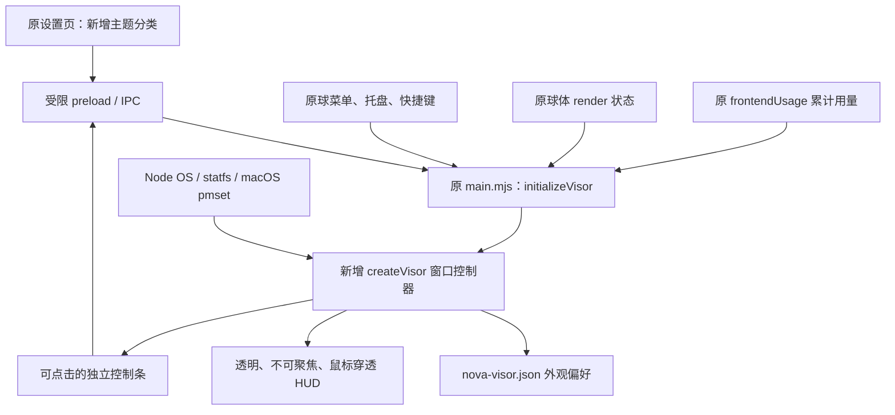

# Nova Visor：使用说明与架构扩展

本分支提供主显示器上的透明桌面 HUD、本地主题设置及 Nova 球体皮肤管理。它是本地客户端功能，需运行包含本分支代码的 Nova；公开发行版不一定包含。当前为 macOS 本地预览，完整交付验收尚未结束。逐轮测试及安装限制见 [验证记录](VISOR_V1.md)。

## 如何打开和收起

1. 启动 Nova，在 **设置 → 通用下方的主题 → Nova Visor** 勾选“启用桌面 HUD”。
2. 或在 Nova 球菜单、系统托盘菜单中选择 **Nova Visor · 展开 / 收起**。
3. macOS 快捷键为 **⌘ + Shift + J**；代码也注册了其他平台的 **Ctrl + Shift + J**，但其他平台尚未认证。若快捷键被占用，使用菜单入口。
4. 底部控制条可切换“专注”“展示”，点击“收起”关闭驾驶舱，点击“NOVA”显示原有语音球。

收起 HUD 不关闭 Nova 语音功能，也不会移除原有球体；退出 Nova 才结束客户端和覆盖层。启用状态会保存，下次启动客户端时恢复。这不等于新增开机自动启动功能。

**语音口令“Nova，切换成 Jarvis”尚未实现。** 当前通过设置、菜单或快捷键操作。

## 如何伴随网页和应用

HUD 是屏幕上方的独立透明窗口，不依附网页，不需要浏览器扩展，也不修改第三方应用。

| 用户操作 | 当前行为与边界 |
| --- | --- |
| 浏览网页、切换浏览器标签 | HUD 保留在主显示器边缘；网页本身不变 |
| 切换到文档、代码编辑器等普通窗口 | HUD 使用浮动置顶层继续显示，不随浏览器关闭而消失 |
| 点击框架、数字或中央透明区域 | 装饰窗口整体忽略鼠标事件，事件交给下方窗口 |
| 点击底部控制条或原来的 Nova 球 | 对应独立窗口接收操作；这些区域不穿透 |
| 移动或最大化应用 | HUD 按屏幕布局，应用独立布局；不会主动缩小或挪动用户窗口。手动拖动验证尚未确认通过 |
| 全屏应用、切换 Spaces、外接屏 | 设置了跨工作区显示行为，但这些组合尚未完成实机认证；首版只布局在主显示器，遮挡时手动收起 |

HUD 不读取当前网页内容、不追踪应用内部状态，也不会自动避让窗口。常驻的是屏幕框架和状态信息；它不是“接管所有应用”的交互代理。

## 主题设置

HUD 设置即时保存到客户端用户数据目录下的 `nova-visor.json`，无需点击底部保存，也不重启语音后台。文件只保存外观偏好，不保存 API Key。

| 字段 | 默认值 | 可调范围 / 作用 |
| --- | --- | --- |
| `enabled` | `false` | 是否展开 HUD；本次本机安装单独设为启用，不改变新用户默认值 |
| `mode` | `focus` | `focus` 专注 / `showcase` 展示 |
| `opacity` | `0.8` | 0.3–1；数值越小越透明 |
| `motion` | `true` | 装配和核心动画；渲染端也遵循系统减弱动态效果 |
| `hardware` | `true` | 显示左侧硬件模块 |
| `ai` | `true` | 显示右侧 Nova 状态和用量 |

原有 **悬浮球皮肤** 管理也移动到“主题”内。球体选择、导入、预览和移除仍走原来的“保存”流程。球体皮肤 v1 是参数 JSON，不能用它导入任意桌面 HUD；本次 HUD 是内置实现。底部 HUD 核心是状态装饰，真正的语音交互仍由原来的 Nova 球承担。

## 显示的数据

- CPU：相邻采样区间的占用率；内存：含缓存的已用物理内存 / 总内存，两秒采样。
- 磁盘：用户主目录所在卷的使用比例；电池：macOS 电量和充电状态，三十秒刷新。台式机或读取失败显示“—”。
- AI：原球体状态、麦克风状态、当前配置模型，以及本次客户端启动以来的接口用量报告。
- Token 只有收到对应统计才显示；费用是已知可计价部分的估算，缺失或未定价会注明，不是账单。底部粒子动画反映状态，不是实际音频波形。

## 在原有架构上如何扩展

继续使用 Nova 的 Electron 主进程、受限 preload 和本地渲染页面；没有新增独立语音服务，也没有更换原有模型请求链路。

| 原有部分 / 新增文件 | 扩展方式 |
| --- | --- |
| [`main.mjs`](../clients/desktop/src/main/main.mjs) | 原渲染资源加载后调用 `initializeVisor`；复用托盘、球菜单、`globalShortcut` 和退出清理。主进程提取允许展示的 AI 状态与用量 |
| [`visor.mjs`](../clients/desktop/src/main/visor.mjs) | 新建 HUD 与控制条两个窗口。按主显示器 `workArea` 定位；显示器变化时重新布局；负责配置落盘、两秒采样调度、开关与资源释放 |
| [`visor-data.mjs`](../clients/desktop/src/main/visor-data.mjs) | 配置归一化、CPU 差分、内存和卷信息、macOS 电池解析；不连接模型服务 |
| [`app-protocol.mjs`](../clients/desktop/src/main/app-protocol.mjs) | 在已有 `nova://orb/` 资源图中增加两个 HTML 入口，静态依赖仍受原白名单约束 |
| [`visor.cjs`](../clients/desktop/src/preload/visor.cjs) | HUD 专用最小桥接：读取快照、订阅状态、提交配置、显示原球。原 preload 增加设置及球状态所需的方法 |
| [`index.mjs`](../clients/desktop/src/renderer/index.mjs) | 原球体渲染时报告既有状态；主进程初始化后请求一次刷新，避免初始状态丢失。不改变麦克风、音频或后端连接流程 |
| [`visor-renderer.mjs`](../clients/desktop/src/renderer/visor-renderer.mjs) / [`visor.css`](../clients/desktop/src/renderer/visor.css) | SVG 屏幕框架、数字仪表、CSS 分段装配动画与 Canvas 状态核心。专注 / 展示核心绘制分别限为 15 / 30 fps |
| [`visor-controls.mjs`](../clients/desktop/src/renderer/visor-controls.mjs) | 独立控制条调用受限桥接；装饰窗口不需要切换鼠标穿透状态 |
| [`settings-categories.mjs`](../clients/desktop/src/renderer/settings-categories.mjs) / [`visor-settings.mjs`](../clients/desktop/src/renderer/visor-settings.mjs) | 通用后新增主题分类，归入 HUD 设置和原有 `orb-skin-section`；HUD 偏好与原语音设置事务分开 |

### 数据与操作边界

- `nova:visor:get`：仅设置窗口及 HUD 自有窗口的主 frame 可读取。
- `nova:visor:configure`：仅设置窗口和控制条主 frame 可调用；主进程校验字段、类型与范围。
- `nova:visor:orb`：仅控制条可请求显示原球。
- `nova:visor:state`：仅原球窗口主 frame 可报告；`nova:visor:refresh` 请求首次状态，`nova:visor:changed` 推送显示快照。
- 新窗口保持 sandbox、context isolation 和 web security；阻止导航和弹出外部窗口。HUD 收不到密钥或后端连接令牌。

### 生命周期

启用时创建两个窗口并启动采样；关闭时发送收起状态、停止采样，动画结束后销毁窗口。快速重新启用会取消待执行销毁，避免旧定时器关闭新界面。退出时释放窗口、定时器及显示器监听；渲染异常时撤下 HUD，保留主客户端。

这里停止采样指主动收起／销毁；系统遮挡或锁屏时的采样、电量和恢复表现尚未完成专项验证，不承诺零后台消耗。

## 验证与待完成项

历史实现验证：255 项相关 Node 测试通过；Electron 隔离窗口验证了真实采样、透明像素、状态和模式切换、配置保存、快速开关及清理。锁屏前通过真实鼠标点击和背后窗口文本编辑测试。构建、打包及本地签名检查通过。

最终签名修正后的安装版 GUI、快捷键和后端就绪状态尚待解锁后复核；全屏、Spaces、多屏、Windows/Linux、长时间功耗测试未认证。当前 PR 是可审阅的本地预览实现，不代表这些验收已经完成，也不代表公开发行。

详细复现命令、签名说明与恢复方法见 [VISOR_V1.md](VISOR_V1.md)。本机桌面截图及配置备份包含私人工作环境，不随代码提交。
